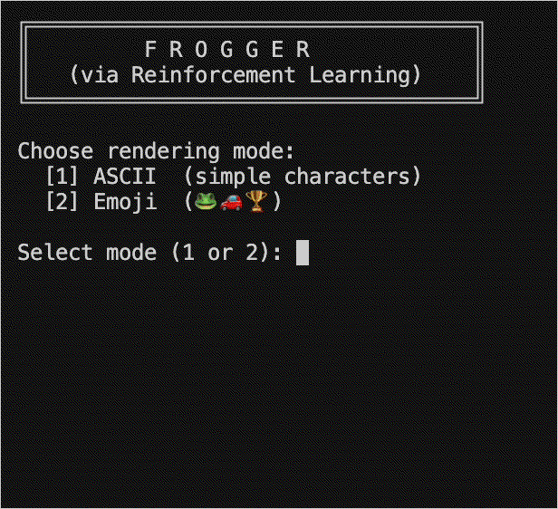
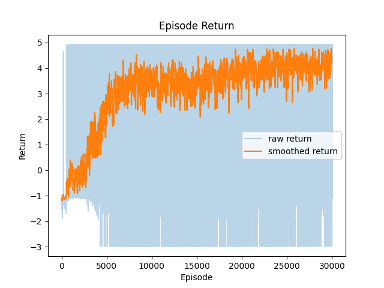
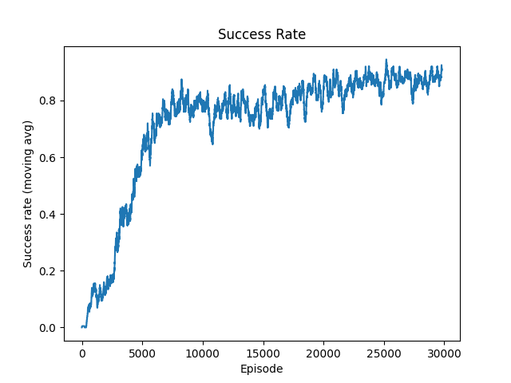
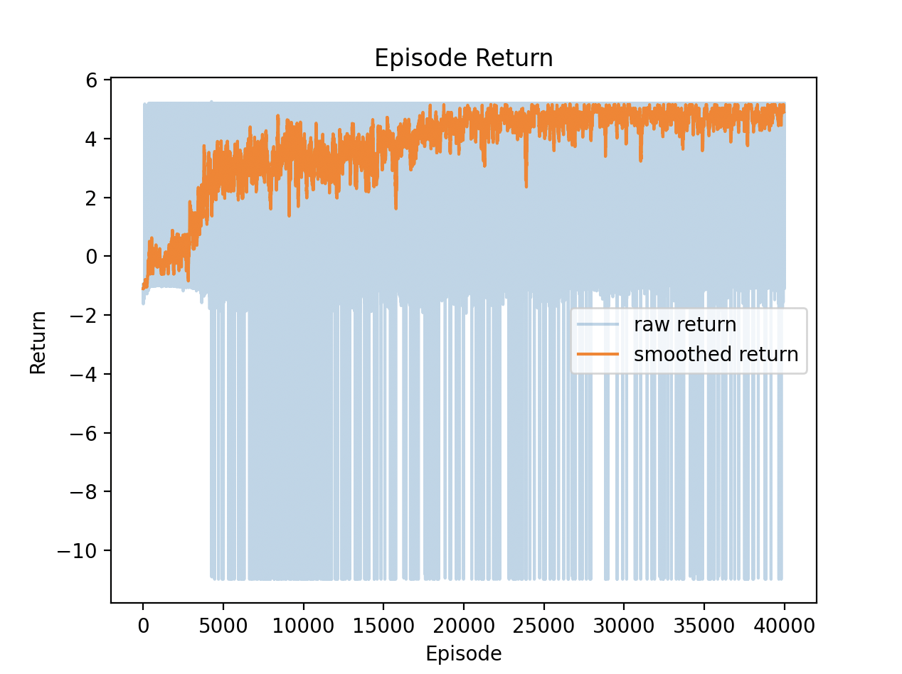
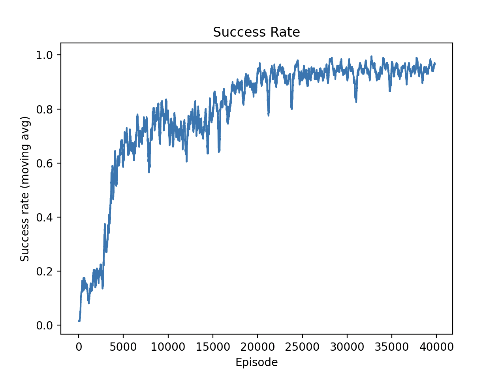
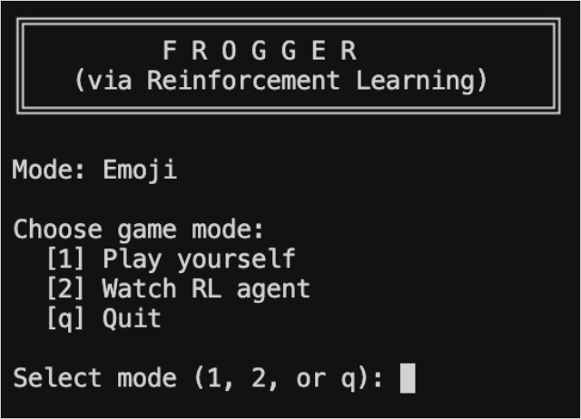
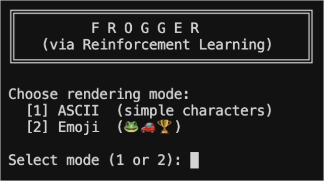
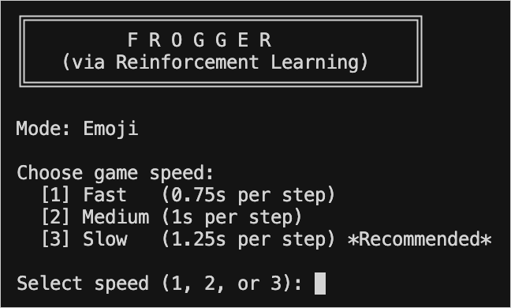

# Frogger + RL

Reinforcement learning applied to a Frogger, featuring a trained RL agent and an interactive command-line UI.

<p align="center">
  
</p>


## Defining the Environement

Here, the goal was to develop a competent Frogger agent that could play on a simplified / discretized version of the arcade game. Ultimately, the state was implemented as follows:

- A fixed `W x H` grid, with cells harboring the player's frog, a car, or the goal (or simply being empty).
- There are four car lanes, two of which flow to the right and two of which flow left.
- The frog begins in an empty row and has to progress through the car lanes in order to reach the 'goal' row **without hitting a car**. 
- Additionally, a `max_steps` attribute was added to introduce a time element that constraints the agent's behavior to optimize the time to reach the goal (and not just linger).

>*The environment is rendered as frogger ASCII or emoji grids for user clarity.*
### Reward Landscape / Surface
The goal was to incentivize the agent to "win" and actually reach the goal row, which motivated the following rewards (and penalties):

- `+5` for reaching the goal row (the only positive reward since we want to emphasize this)
- `-1` for collision with car (want to avoid death, but not so large as to discourage exploration)
- `-10` for exceeding maximum number of steps (i.e., running out of time generally isn't justified). 
- `-0.02` per step to avoid unnecessary long paths, waiting, "dithering". 

Through the first few iterations of training, found that the magnitude of the penalty for exceeding `max_steps` was too small, such that it was actually advantageous to exceed the maximum number of steps rather than collide with a car. As such, the agent's policy likely learned this strategy as a local minimum that sufficed in optimizing loss. 

As such, decided to drastically increase the penalty from an initial `-0.5` to `-2.0`, and then found that further increases (to an arbitrarily large penalty of `-10` yielded greater success by training away the lingering, `max_steps` strategy).

> **Note:** because this reward structure is inherently sparse, a small positive reward was later added for forward progress, discussed in reward shaping further below.

## Training

Ultimately trained the action-taking agent using an MLP policy using the REINFORCE policy gradient (augmented with entropy and baseline).

> **TL;DR:** built Frogger-playing agent with ~95+ % success rate.

### Policy Definition

Implemented a 2-layer MLP with the following:

**Input:** `3 x H x W` vector

- Had 3 channels in the input grid (one for the frog location, car locations, and goal-row locations respectively)
- Flattened this grid into a (by default, `3 x 6 x 5 = 90` input-) state vector

**Output:** 5 logits that are translated into one of 5 actions:

- `0 = UP`
- `1 = DOWN`
- `2 = LEFT`
- `3 = RIGHT`
- `4 = STAY`

### Optimizing Policy

Using whatever action the policy produced in the current episode (training sample), the environment was progressed using its `.step()` method, which moves cars, the frog using the action, and calculates reward, collision occurrence, etc.

#### Return & Advantage Computation

- **Temporal Credit Assignment (via Monte Carlo Returns):** used discount factor (gamma) to more proportionately adjust recent actions when handling rewards. The following process was used to calculate the returns for the action taken given timestep `t` using rewards `r_k`:

```math
G_t = \sum_{k=t}^{T-1} \gamma^{\,k-t} \, r_k, \gamma=0.99
```
  
- **Baseline Smoothing:** found lots of noise in the gradients when training, so used this to reduce the high variance and smooth gradient estimates (by subtracting out an expected, baseline return, meaning that the policy specifically updates when action is worse / better than the mean). The following was used to translate raw returns into an 'advantage' by subtracting `b`, the running mean of returns to compare against.

```math
A_t = G_t - b
```

#### Encouraging Initial Policy Exploration
  
- **Decaying Entropy:** increased action stochasticity earlier on in training to encourage exploration, which helped the agent develop a more generalizable policy rather than relying on highly probable actions. Specifically calculated the entropy of the action distribution from the MLP policy (probabilities `pi_theta`) as follows:

```math
H(\pi_\theta(\cdot \mid s))
=
-
\sum_a
\pi_\theta(a \mid s) \,
\log \pi_\theta(a \mid s)
```

>**Intuition:** high entropy corresponds to a more uniform disribution, i.e., one that has a more widespread likelihood within the action space, so the agent is more likely to explore a variety of actions.

#### Loss Formulation

- Following the standard optimized REINFORCE approach, composed the loss as a balance between (1) 'greedy' exploitation from seeking to adjust probabilities of taken actions by their (dis)advantages, i.e. increasing/decreasing the probabilities of actions that performed better/worse than expected and (2) adjusting policy parameters to encourage exploring breadth of actions earlier on.
- Used `beta` as a decaying term throughout the training process such that the effect of entropy was larger earlier on, which has a progressively lower impact as the parameter itself decays *and* as the advantages from the agent's learning increase to dominate the loss calculation:

```math
L(\theta)
=
-\sum_{t=0}^{T-1}
\Big(
A_t \,\log \pi_\theta(a_t \mid s_t)
\;+\;
\beta \, H\!\left(\pi_\theta(\cdot \mid s_t)\right)
\Big)
```

This loss is used to compute the **policy gradient**, which accordingly updates MLP policy parameters.

#### Training Details

Ran training with key parameters as follows, computing loss and updating the policy accordingly after each `episode`:

```bash
python train_agent.py
```

```python
num_episodes=30000
gamma=0.99
beta_range=(0.1, 0.02)
learning_rate=1e-3
````

- Training logs are saved to `training_logs.txt` (not displayed to console)
- Every `render_every` episodes, can watch the agent play with clean rendering
- After training, plots show returns, loss, and success rate
- Trained policy is saved to `checkpoints/frogger_policy_{accuracy}.pt`

> **Note:** chose `num_episodes` after finding policy success/gradient jumped again after ~20k episodes; `gamma`, `beta` , and other parameters were chosen and loosely tweaked based on standard values.

## Training / Optimization Takeaways

Upon augmenting the initial training process with things like advantages (baseline smoothing) and decaying entropy, found that the improvement in guiding the agent to find winning strategy that was (a) more successful and (b) achieved earlier on lay in a mix of these two optimizations, but mostly in the addition of entropy.

As explained prior, observed that the return and success achieved their maxima (at least with this policy and training approach) **far earlier when incorporating decaying entropy**. This can likely be attributed to the fact that in doing so, the agent is pushed to adjust its weights early on to explore a broader variety of actions in its space, allowing it to discover successful patterns like moving `UP`, `LEFT`, etc. in whatever pattern to avoid cars in order to be able to achieve the reward at the goal line. 

The following shows this with greater clarity:

>*Return & success respectively across 30000 episodes **prior** to adding entropy*

<p align="center">
  
  
</p>

>*Return & success respectively across 30000 episodes **after** adding entropy*

<p align="center">
  
  
</p>

### Successful Reward Shaping

A problem with applying a strategy like REINFORCE / policy gradients to a sparse reward structure like Frogger (i.e., only achieve any positive reward upon reaching the end goal) is that positive signals for things like forward progress aren't learned explicitly *until* the agent manages to reach the end goal for the first time. 

**Solution:** decided to add a small reward when the agent makes forward progress into the lanes, with that reward growing linearly as it reaches closer to the goal (at which point the agent is granted the final `+5` reward) to also help offset the dithering step penalty since successful forward progress is good. 

```python
fwd_progress_reward = 0.02 * row # row in lanes [0, 5]
```

Upon using this slightly adapted reward structure — along with slightly more training episodes, also noting that cumulative return is higher because of shaping-induced intermediate rewards — was able to boost return and success to $\geq 95\%$:

>*Return & success respectively across 40000 episodes **after** reward shaping*

<p align="center">
  
  
</p>
 

> **Note:** the loss across all versions here (not shown) is not as telling, given that it's an indirect representation of returns, and as such, the loss through training remains relatively noisy (which is not inherently problematic).

### Next Steps & Future Directions
While this MLP + policy gradient approach (via REINFORCE pattern) works relatively well, shown through the minimal training load and success achieved (with the few optimizations that were made), there are definitely ways in which this can be taken further:

- **Q-Learning (...and DQN?):** an approach that might lend itself to this set-up, which has a relatively simple environment and action space compared to something like Go or even Chess.
  
- **Actor-Critic:** makes use of a ```critic``` that can estimate the value of the given state to generate a more stable learning signal, then communicate that to the ```actor``` to update its policy more efficiently; helpful for reducing variance.
  
- **Augmenting Environment:** to make the game more interesting, one could introduce stochasticity to existing obstacles (e.g., the number of cars, speed), create new obstacles (e.g., fast-moving vehicles, logs on water), and do much more, inviting exploration into whether this RL approach might succeed there or whether stronger approaches (including those mentioned above) might be necessary.


## Running Agent ( + Optional Gameplay)

The trained agent can be run live in the frogger grid, and through interaction, one can see that it generally succeeds $\geq 90$% of the time. Though the behavior was minimized, the "dithering" tendancy/strategy to wait out the game through `max_steps` occasionally reappears (though some of the next steps above could help eliminate or at the very least minimize this further)... 

### Run Frogger Agent CLI

```bash
python frogger_cli.py
```

#### Features

- **Two Play Modes:**
  > Watch the trained RL agent navigate and try to win, **or** play yourself with real-time game updates (cars keep moving)

  <p align="center">
    
  </p>

- **Two Rendering Modes:**
  > ASCII mode (initial, more simple) **or** Emoji mode 

  <p align="center">
    
  </p>

- **Three Speed Settings (Human Play):**
  > `Fast` (0.75s per step),  `Medium` (1s per step), `Slow` (1.25s per step)

  <p align="center">
    
  </p>
  

### Controls (User Play)

The game runs continuously, i.e., cars keep moving even when user doesn't act.

- `W`: Move up
- `A`: Move left
- `S`: Move down
- `D`: Move right
- `Space`: Stay in place (or don't press anything)
- `Q`: Quit

## Project Components

`frogger_cli.py` - interactive UI (recommended way to watch agent & play)<br>
`frogger_env.py` - Frogger game environment implementation<br>
`frogger_policy.py` - Network / MLP policy for frogger agent action<br>
`train_agent.py` - Training script with logging and visualization<br>
`render_utils.py` - Shared rendering utilities<br>
`simulate_frogger_agent.py` - Isolated agent evaluation and visualization<br>
`human_play.py` - step-by-step human play mode<br>
`checkpoints/frogger_policy_98.pt` - Best learned policy<br>
`training_logs.txt` - Training logs (episode by episode, generated during training)

## References & Resources

### REINFORCE Algorithm

- [Lil'Log: Policy Gradient Methods](https://lilianweng.github.io/posts/2018-04-08-policy-gradient/)
- [CS229 Lecture Notes: Reinforcement Learning](https://cs229.stanford.edu/notes2020fall/notes2020fall/cs229-notes14.pdf)
- [Wikipedia: Policy Gradient Method](https://en.wikipedia.org/wiki/Policy_gradient_method)
- [Medium: REINFORCE Algorithm from Scratch in PyTorch](https://medium.com/@sofeikov/reinforce-algorithm-reinforcement-learning-from-scratch-in-pytorch-41fcccafa107)

### Q-Learning & SARSA

- [Annual Review of Statistics: Temporal Difference Learning](https://www.annualreviews.org/content/journals/10.1146/annurev-statistics-031219-041220)
- [Model-Free Control with SARSA](https://pantelis.github.io/aiml-common/lectures/reinforcement-learning/model-free-control/sarsa/index.html)

### Actor-Critic Methods

- [Wikipedia: Actor-Critic Algorithm](https://en.wikipedia.org/wiki/Actor-critic_algorithm)
- [RL Notes: Actor-Critic](https://gibberblot.github.io/rl-notes/single-agent/actor-critic.html)

### Deep Q-Networks (DQN)

- [Medium: Deep Q-Learning (DQN) Explained](https://medium.com/@samina.amin/deep-q-learning-dqn-71c109586bae)
- [Hugging Face: Deep RL Course - Unit 3](https://huggingface.co/learn/deep-rl-course/en/unit3/deep-q-network)
- [YouTube: DQN Tutorial](https://www.youtube.com/watch?v=EUrWGTCGzlA)
